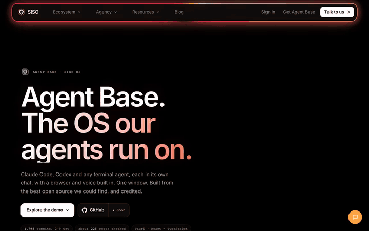

<!-- siso-os:header (generated by sisodias/siso-os-release from repos.json; edit there, not here) -->
<p align="center">
  <a href="https://www.sisolabs.space/agent-base/"></a>
</p>
<h1 align="center">SISO Agent Playbook</h1>
<p align="center"><b>Repeatable multi-agent operating scenarios: how to run a fleet of agents under a budget.</b></p>
<p align="center">
  <a href="https://www.sisolabs.space/agent-base/"></a>
  <a href="https://github.com/siso-os/siso-agent-playbook-public/blob/HEAD/LICENSE"></a>
  <a href="https://github.com/siso-os"></a>
  <a href="https://github.com/siso-os/siso-agent-playbook-public/stargazers"></a>
</p>
<p align="center">
  <a href="https://www.sisolabs.space/agent-base/"></a>
</p>
<p align="center">
  <a href="https://www.sisolabs.space/agent-base/"><b>Website</b></a> · <a href="https://docs.sisolabs.space">Docs</a> · <a href="https://github.com/siso-os">Every SISO OS project</a>
</p>

<!-- /siso-os:header -->
A battle-tested operating system for running multi-agent AI fleets (Claude Code, Codex CLI,
MiniMax workers) without burning yourself: budget-governed lanes, zero-token completion,
fresh-context-per-task workers, benchmark-calibrated model routing, and a telemetry layer
that answers the only question that matters — **what did the tokens buy?**

Born from a measured disaster-and-recovery arc (see `TIMELINE.html`): a 2.27B-token drain,
80%-idle fleets, and the discovery that most fixes were machinery we already owned, switched off.

## Quick Start

```bash
git clone https://github.com/Lordsisodia/siso-agent-playbook.git
cd siso-agent-playbook
WORKSPACE="$HOME/SISO_Workspace" ./install.sh
```

Then set `BIFROST_VIRTUAL_KEY` in `~/.config/siso-agent-playbook/secrets.env`. The installer
symlinks the skills into `~/.claude/skills`, copies the command-line tools into `~/bin`, creates
the workspace telemetry tree, and installs the 10-minute lane-health and weekly stack-check
launch agents. It is safe to re-run; existing collisions are backed up and restored by
`./uninstall.sh`.

`MINIMAX_API_KEY` is optional and enables the direct MiniMax five-hour-window health probe. Keep it in local environment or in the generated secrets file; never commit it.

For the complete machine in one page, read **[Architecture](docs/ARCHITECTURE.html)**.

## What's inside
- `skills/` — drop-in Claude Code skills: `model-routing` (benchmark matrix + escalation ladder),
  `fan-out` (parallel dispatch discipline), `subagents` (lane picking), `haiku-dispatch`
  (fail-loud headless workers), `telemetry` (the instruments).
- `bin/` — the tools: `lane-health` (heartbeat + runaway reaper), `herdr-await` (zero-token
  completion), `brief-lint` (refuses poison briefs), `mini-headless`/`mini-task` (one bounded
  job, fresh context, self-terminating), `stack-check` (18-invariant test suite for the stack itself).
- `prompts/` — the prompt bank: six proven worker briefs (scout, verifier, miner, refuter,
  n-version builder, bookkeeper) with contracts baked in — a weak model can't write a bad brief
  if it starts from a good one.
- `docs/` — the evidence: the full GQ-002 analysis (RESULTS), implementation receipts,
  and the model capability dossier.

## The five laws (the whole thing in one breath)
1. **One agent = one task.** Fresh context per job; sessions never accumulate. (Reuse was 75% of our drain.)
2. **Completion is an event, not a poll.** Workers write result files; watchers wake dispatchers. No model ever babysits a terminal.
3. **Budgets live in the gateway, not in discipline.** Rate-limit every lane; heartbeat every lane; silent = dead.
4. **Route by measured strengths.** Benchmarks are the prior, your own outcomes are the posterior. (Matrix in `skills/model-routing`.)
5. **Doctrine decays — laws live as physics, gates, and scheduled tests** (`bin/stack-check`), never as prose alone.

## Setup Notes

- `WORKSPACE` defaults to `~/SISO_Workspace` and owns `.agents/telemetry/{events,logs,state}`.
- `~/bin` must be on `PATH`; the tools also honor `SISO_BIN_DIR`, `HERDR_BIN`, and
  `CLAUDE_MINI_BIN` when your dependencies live elsewhere.
- `lane-health` requires a running local Bifrost gateway and `BIFROST_VIRTUAL_KEY`.
- `mini-task` and `herdr-await` require the external `herdr` CLI; MiniMax dispatch tools require
  a local `claude-mini` wrapper.
- To exercise installation without touching real home directories, use
  `PREFIX=/tmp/playbook-home WORKSPACE=/tmp/playbook-workspace ./install.sh`. A non-empty
  `PREFIX` also suppresses `launchctl` loading.

## Great Library identity

- Work: `gls:work:083503ab-c78e-4e07-ac40-ab9466dcedcc`
- Section: Agents
- Role: playbook layer of the Agents operating stack
- Catalog: <https://great-library-of-siso.vercel.app/works/siso-agent-playbook/>

Skills are atomic capabilities; this Playbook composes skills, tools, prompts, gates, and telemetry into repeatable operating scenarios. Both belong under Agents, but they retain different adoption and release lifecycles.